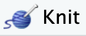
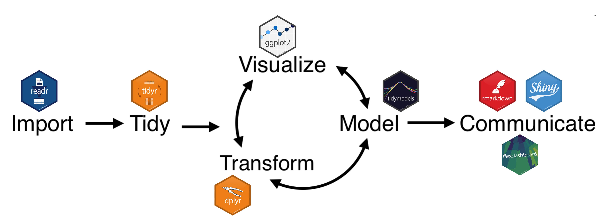
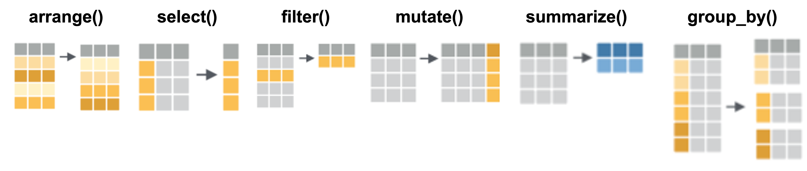
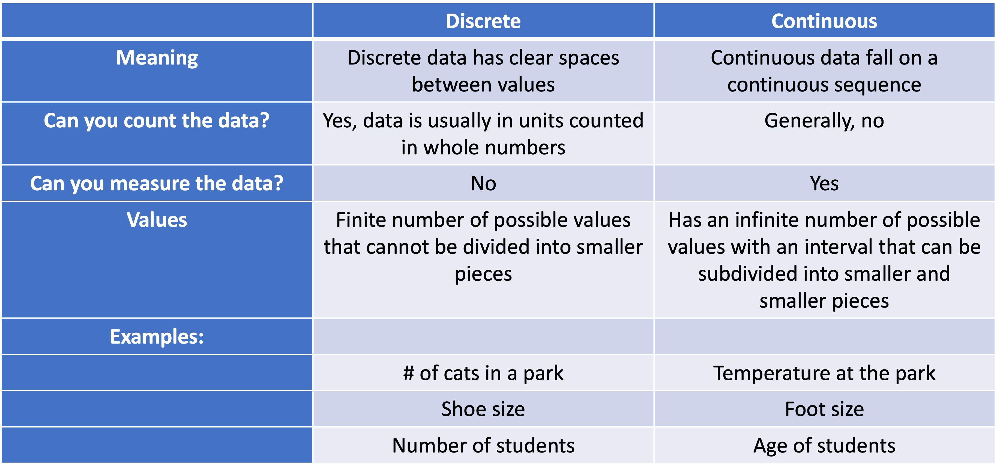
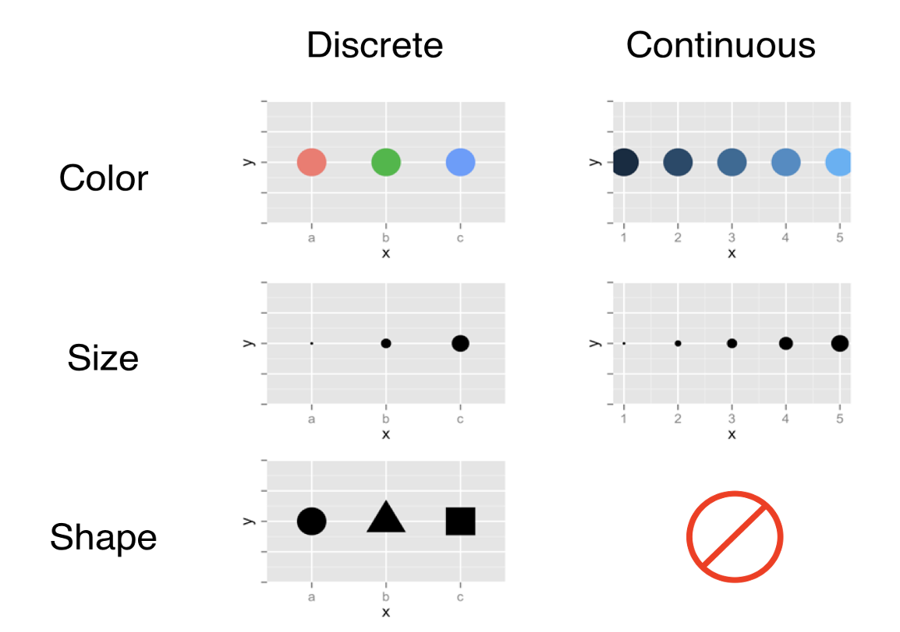
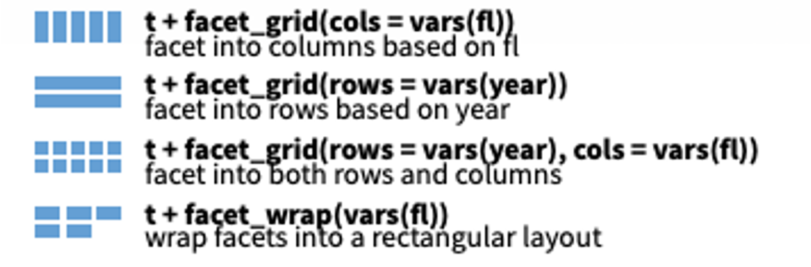
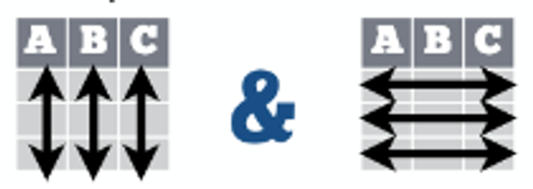
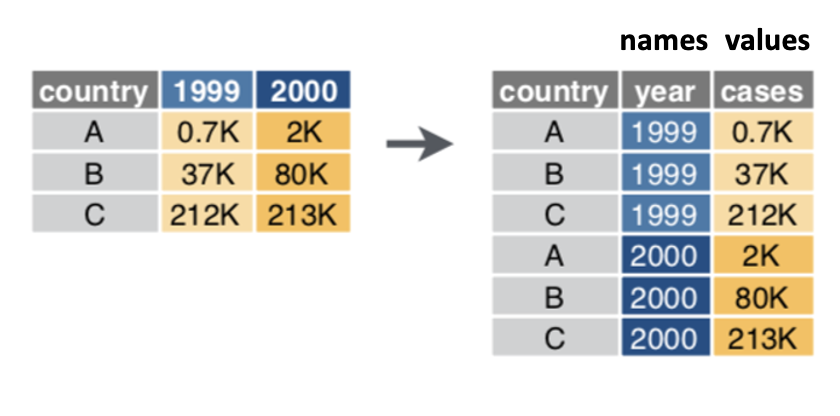
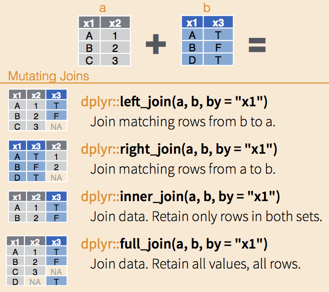

```{r setup, include=FALSE}
# This sets the global option so no future chunks will execute
knitr::opts_chunk$set(eval = FALSE)
```


## Welcome!

Hello, and welcome to this workshop! We are using an R Notebook. An R Notebook is an R Markdown document with code blocks that can be executed independently and interactively, with the output visible immediately beneath the input. They are an implementation of [Literate Programming](https://en.wikipedia.org/wiki/Literate_programming) that allows for direct interaction with the R programming language while producing a reproducible document with publication-quality output. R notebooks can also be rendered using the knit button {width="53" height="23"} to create an HTML document that is easily viewable outside of R. We can see the difference between text and code as the text is in the white space and code blocks are in grey. To run any particular line of code, click the green play button {width="14" height="17"} in that chunk, or with the cursor in the grey code block, press control, shift, enter (⬆⌘⏎) simultaneously.

```{r}
plot(cars)
```

We see our results from that line of code immediately below it, which happens to be a graph about the speed and distance of different kinds of cars. Let's move on to the data we will use for this workshop!

## Introduction

This notebook introduces you to the `MotrpacRatTraining6moData` package, which contains the processed data for the **Molecular Transducers of Physical Activity Consortium (MoTrPAC)** endurance training study in six‑month‑old rats. The goal of this notebook is to provide a beginner‑friendly tour of the data.

## Packages

### **What is a package?**

An R Package is a collection of:

- R functions

- Documentation and help files

- Sometimes built-in datasets (can be only a dataset)

All packaged together for a specific purpose (for example: data visualization, statistics, or access to a particular dataset).

When a package is installed, it is saved in a directory called "**Library"**.

### **Load a package**

Packages are not automatically active when you start R.

This is intentional because:

- Packages are created by many different people with no global checks on function names, so they may end up clashing

- Most projects only use a small handful of packages

- More than 20,000 packages would make loading R very slow

Because of this, we explicitly load only the packages we need for a given analysis.

### Where do R packages come from?

R packages can be installed from different repositories. A repository is simply a place where packages are stored and distributed.

The three most common repositories you will encounter are:

1.  GitHub

GitHub is a public platform where developers share and collaborate on code.

Packages on GitHub are often:

- Under active development

- Research or project-specific

- Many scientific datasets and analysis tools are distributed this way

- Requires the `devtools` packages

```{r}
#install.packages("devtools") #This has already been installed
options(timeout=1e5) # extend the timeout
devtools::install_github("MoTrPAC/MotrpacRatTraining6moData")
```

For this course, we installed the MoTrPAC data package from GitHub, because it is a specialized research package that is not available on CRAN.

2\. Bioconductor

Bioconductor is a repository specifically for bioinformatics and computational biology packages.

Widely used for:

- Omics analysis (transcriptomics, proteomics, genomics)

- Other high-throughput biological data

- Many Bioconductor packages depend on each other and follow a coordinated release schedule

- Requires the `BiocManager` packages

To install packages from Bioconductor, we use the BiocManager package:

```{r}
#This is an example, we don't need any bioconductor packages for this activity 
#install.packages("BiocManager") 
#BiocManager::install("impute") 
```

3.  CRAN (Comprehensive R Archive Network)

- CRAN is the main, official repository for R and R packages

- Mirrored to many cites around the world

- Most general-purpose R packages live here

To install a package from CRAN, we use:

```{r}
#install.packages("tidyverse") #This is already installed on this build
```

This is the most common way you will install packages in R.

### **Installing vs loading a package**

These two steps are different and can be a bit confusing:

- **Installing** a package:

  - Downloads it to your computer or a specific cloud project

  - You only need to do this once per computer or per project in posit cloud

- **Loading** (or “turning on”) a package:

  - Makes it available in your current R session

  - You need to do this every time you start a new session

We can check which packages are available by looking at the Packages tab in the lower-right panel in RStudio:

- If there is a check mark next to a package name, it is currently loaded

- If it appears in the list but is unchecked, it is installed but not loaded

For example, if we search for MotrpacRatTraining6moData, we may see that it is installed but not yet turned on. Let's go ahead and load the the MOTRPAC data package.

```{r}
library(MotrpacRatTraining6moData)
```

## The Data

The MoTrPAC endurance study examined the effects of endurance exercise training on six‑month‑old male and female Fischer 344 rats. Animals were trained for 1, 2, 4, or 8 weeks using a progressive treadmill protocol, and tissues were collected 48hours after the last exercise bout. Sedentary, untrained rats served as controls. Multiple omics technologies (transcriptomics, proteomics, metabolomics, etc.) were applied across many tissues.

We can explore what datasets are accessible in the MotrpacRatTraining6moData by clicking on it in the packages tab. We can also read more on the package details in general [here](https://motrpac.github.io/MotrpacRatTraining6moData/). A list of all the available data objects and a brief description are available [here](https://motrpac.github.io/MotrpacRatTraining6moData/reference/index.html).

### Tissues

- **ADRNL:** adrenal gland
- **BAT:** brown adipose tissue
- **BLOOD:** whole blood
- **COLON:** colon
- **CORTEX:** cerebral cortex
- **HEART:** heart
- **HIPPOC:** hippocampus
- **HYPOTH:** hypothalamus
- **KIDNEY:** kidney
- **LIVER:** liver
- **LUNG:** lung
- **OVARY:** ovaries (female gonads)
- **PLASMA:** plasma from blood
- **SKM-GN:** gastrocnemius (leg skeletal muscle)
- **SKM-VL:** vastus lateralis (leg skeletal muscle)
- **SMLINT:** small intestine
- **SPLEEN:** spleen
- **TESTES:** testes (male gonads)
- **VENACV:** vena cava
- **WAT-SC:** subcutaneous white adipose tissue

### Assays/omes

- **ACETYL:** acetylproteomics; protein site acetylation
- **ATAC:** chromatin accessibility, ATAC-seq data
- **IMMUNO:** multiplexed immunoassays (cytokines and hormones)
- **METAB:** metabolomics and lipidomics
- **METHYL:** DNA methylation, RRBS data
- **PHOSPHO:** phosphoproteomics; protein site phosphorylation
- **PROT:** global proteomics; protein abundance
- **TRNSCRPT:** transcriptomics, RNA-Seq data
- **UBIQ:** ubiquitylome; protein site ubiquitination

### Summary of data

Here is a brief summary of the kinds of data included in the data package:

- Assay, tissue, sex, and training group abbreviations, codes, colors, and order used in plots
- Phenotypic data, `PHENO`
- Mapping between various feature identifiers, i.e., `FEATURE_TO_GENE`, `RAT_TO_HUMAN_GENE`
- Ome-specific feature annotation, i.e., `METAB_FEATURE_ID_MAP`, `METHYL_FEATURE_ANNOT` (GCP only), `ATAC_FEATURE_ANNOT` (GCP only), `PROT_FEATURE_ANNOT` (GCP only), `PHOSPHO_FEATURE_ANNOT` (GCP only), `UBIQ_FEATURE_ANNOT` (GCP only), `ACETYL_FEATURE_ANNOT` (GCP only), `TRNSCRPT_FEATURE_ANNOT` (GCP only)
- Ome-specific sample-level metadata, i.e., `TRNSCRPT_META`, `ATAC_META`, `METHYL_META`, `IMMUNO_META`, `PHOSPHO_META`, `PROT_META`, `ACETYL_META`, `UBIQ_META`
- Raw counts for RNA-Seq (TRNSCRPT), ATAC-Seq (ATAC), and RRBS (METHYL) data, e.g., `TRNSCRPT_LIVER_RAW_COUNTS`. Note that epigenetic data (ATAC and METHYL) must be downloaded from Google Cloud Storage. See more details [here](https://motrpac.github.io/MotrpacRatTraining6moData/index.html#access-epigenomics-data-through-google-cloud-storage).
- Normalized sample-level data, e.g., `TRNSCRPT_SKMGN_NORM_DATA`
- Differential analysis results, e.g., `HEART_PROT_DA`
- Sample outliers excluded from differential analysis, `OUTLIERS`
- Table of training-regulated features at 5% FDR, `TRAINING_REGULATED_FEATURES`
- Bayesian graphical analysis inputs and results
- Pathway enrichment of main graphical clusters, `GRAPH_PW_ENRICH`

One important object in the data package is **PHENO**, which contains phenotypic information for every sample in the study. We can always get more information on any function or annotated dataset in R by using `?`, or typing PHENO in the help tab.

*Note that `MotrpacRatTraining6moData` must be installed and loaded with `library()` for this to work.*

```{r}
?PHENO
```

This data frame has one row per sample (viallabel) and includes variables describing the animal (pid), its sex, group assignment, training protocol, and many physiological measurements. The PHENO data object is available automatically when the package is loaded but let's create an R object so it is easier to manipulate.

## Creating an Object

An R object contains information stored in R's temporary memory. It could be lists, tables, plots, and more! Once an object is stored, we can retrieve and manipulate it at any point in our coding work. The process of storing an object is called "**assignment" (`<-`)** and requires giving an object a name.

Object names have some general rules:

- The first character can't be a number

- It cannot contain special symbols

- It cannot contain spaces

- Must use either an underscore (snake_case) or Capital letters (CamelCase) to break up multiple words

- Names are case-sensitive. For example, If we call an object **C**ool**D**ata, we need to use the capital **C** and **D** to call it again later. If we try and print **c**ool**d**ata, nothing will happen.

- Avoid commonly used names like: min, mean, max. How do you know the name is already used? Start typing a name in the code chunk and if it gets a colored highlight or suggested autocompletion its already in use!

- Names should be unique and understandable but short. We don't want to keep typing a really long name!

Once we create an object, we can print the data stored within it at any time by typing the object's name in a code block.

Let's try a quick exercise. Let's assign the word object_five to the number 5. If we run the code chunk below we don't see anything printed, but if we look in our environment tab in the upper right panel, we see that R has in its memory that the object name `object_five` has a value of 5. If we want to print what the object contains, we only need to add the name to the code chunk below.

```{r}
object_five <- 5
object_five
```

Let's also create an object called `object_six` and assign it's value to the number `6`. Do this in the code chunk below:

```{r, solution=TRUE}

```

We can now ask R to add these two objects. Add `object_five` and `object_six` together in the code chunk below:

```{r, solution=TRUE}

```

If we wanted to instead create a new object called `output_sum` and assign the output of `object_five + object_six` to it, how would we do that? Add your solution to the code chunk below:

```{r, solution=TRUE}

```

If we wanted to combine multiple values or objects into a vector rather than add them, we need to use a function, specifically the `c` function. The `c` function is a useful generic function used to combine values into a list. Remember we can check out more information about this function any time by checking the help tab or typing `?c`. Let's create a new object called `obj_comb` and assign (`<-`) to that object the combined values of `object_five` and `object_six` using the `c` function in the code block below:

```{r, solution=TRUE}

```

### Loading the PHENO object

Now that we know what an object is, let's create one from the MOTRPAC PHENO data. First, we need to create a useful name for the object we want to make. We will call the object `rat_pheno` for this dataset. We then will use the assingment operator `<-` to assign the dataset to that name. We then need to specify which dataset from the MotrpacRatTraining6moData we want, in this case `PHENO` . If we want to print the data stored in the object as an output in the notebook we need to call the object name `rat_pheno` on the next line.

We can also use `View(rat_pheno)` or click the white space next to the object name in the "Environment" tab to get an interactive spreadsheet. Any action performed in View will not change the underlying dataset.

```{r, solution=TRUE}

```

We can explore this dataset in a couple of different ways. We can look at the dimensions of the data (as in the total number of rows and columns) using the `dim` function. If we want more information about this function or any other in R, we can always type `?` in front of the function. More information about the function will pop up in the help tab in the lower right corner panel. We can also directly type functions into the search box in this panel at any time. When we run the `dim` command, we see 6156 rows (vials) and 509 columns (variables). If we wanted to query the number of rows or columns separately, we could use `nrow` and `ncol`, respectively.

```{r, solution=TRUE}

```

## Tidyverse

We could continue using base R, but it may make more sense to use the `tidyverse`. The [tidyverse](https://www.tidyverse.org/) is a collection of R packages specifically designed for every step of a data science workflow.



One great thing about the tidyverse is its tendency to use plain language for its function names. Just like previously, this package has been installed on the workspace, so we only need to turn on the package. Do this in the empty code block below:

```{r, solution=TRUE}

```

## Data Manipulation

We will specifically use the [dplyr](https://dplyr.tidyverse.org/) package first. This package was created for data wrangling, which is another way of saying data manipulation and cleaning. We will explore the six most commonly used data manipulation functions in this package which are: `arrange`, `select`, `filter`, `mutate`, `summarize` and `group_by`.



### Select()

Generally we only want to work with the specific columns we will use in an analysis. With the `select` function we can extract just those columns of interest into data frame. The other handy thing about the select function is that we can also rename while we extract.

Let's select a few variables:

- **pid** – unique animal identifier (rat ID)
- **viallabel** – unique sample identifier
- **sex** – factor indicating male or female
- **group** – simplified training group (control, 1w, 2w, 4w, 8w)
- **intervention** – indicates whether the animal was in the training or control intervention
- **weight** – body weight at sacrifice (terminal body weight)
- **first VO2 max**- VO2 at max for the first training session
- **last VO2 max**- VO2 at max for the last training session

First we need to create a new object called `pheno_select` and we will assign to that object (`<-`) the output from using the `select` function on the `rat_pheno` object selecting just the `pid`, `viallabel`, `sex`, `group`, `intervention`. Let's also select the `terminal.weight.bw` but let's give it the shorter name `weight`. Finally let's select the first VO2 max measure (`vo2.max.test.vo2_max_1`) but shorten it to `vo_max1` as well as the last VO2 max measure (`vo2.max.test.vo2_max_2`) but shorten it to `vo_max2`. We also want to print the output which we can do by adding the name of the object in its own line.

```{r}
pheno_select <- select(rat_pheno, pid, viallabel, sex, group, intervention, weight = terminal.weight.bw, vo_max1=vo2.max.test.vo2_max_1, vo_max2=vo2.max.test.vo2_max_2) 
pheno_select
```

We know that this selection worked as we can see that there are now only 6 variables.

We can also take the complement of a set of variables by using the NOT (!) operator. Let's say we want everything but the bid and viallabel Let's create a new object, `pheno_deselect`, and use the `select` function on the `rat_pheno` object to negate (`!`) a selection for the combined list (`c`) of variable names `bid` and `viallabel` in the code block below:

*Hint: We can always use ?select or the help tab to find examples of the exact syntax needed to negate a selection.*

```{r, solution=TRUE}

```

We know that this deselection worked as we can see that there are 507 variables instead of 509 and we no longer see the columns bid and viallabel.

### Arrange()

Let's say we are interested the smallest rat weight. We will use the `arrange` function on the `pheno_select` object and sort the `weight` variable, arranging the data so that the lightest animal is at the top of the data frame.

```{r}
arrange(pheno_select, weight)
```

We see that the lightest rat weight is 163.5.

If we are instead interested weight of the heaviest rat, we can arrange our data in descending order. Use the `arrange` function on the `pheno_select` object column `weight` making sure to use the correct option for descending order. Let's do this in the code block below:

*Hint: We can always use ?arrange or the help tab to find out what the syntax would be to sort in descending order instead of the default ascending order.*

```{r, solution=TRUE}

```

We see that the heaviest rat weight is 399.4.

### Filter()

We may only be interested in the male rats for this dataset. We can use the `filter` function to subset the data retaining only rows that satisfy the condition "male". We will create a new object called `pheno_filter`. We will use the `filter` function on the `pheno_select` object. In the `sex` column, we only want values that exactly match (`==`) `"male"`. We will print the output by calling the object name `pheno_filter`. Let's do this in the code block below:

*Note: The filter function will take logic operators such as & (and), \| (or), \< (less than), \> (greater than), ! (not), == (equal).*

```{r}
pheno_filter <- filter(pheno_select, sex=="male") 
pheno_filter
```

We can see that the row number has decreased from 6156 to 3084 and we no longer see any female rats listed.

We can also filter based on a numerical threshold. Let's say we want to overwrite our `pheno_filter` object, using the `filter` function on the `pheno_select` object for `male` rats over a `weight` of `300` grams. Let's do this in the code block below:

```{r, solution=TRUE}

```

We can see that the row number has decreased from 6156 to 2708 and they are all male rats over 300 grams.

### Mutate()

We may be interested creating a new column that is a function of an existing variable. For instance the data in the sex column is currently defined as character, but really sex is a factor level variable. Let's go ahead and convert this column from a character string into the recognizable factor groups "male" and "female". In this case we want to modify a column with new information which is exactly what the `mutate` function is for. We will create a new object called `pheno_mutate`. We will then use the `mutate` function on the `pheno_select` object, we want to write our output back into the `sex` column. We will use the `as.factor` function on the `sex` column.

```{r}
pheno_mutate <- mutate(pheno_select, sex = as.factor(sex))
pheno_mutate
```

We may also want to fix the group column to be a factor as well. Write your results back into the `pheno_mutate` object. We will then use the `mutate` function on the `pheno_mutate` object, we want to write our output column back into the `group` column. We will use the `as.factor` function on the `group` column. Do this in the code chunk below:

```{r, solution=TRUE}

```

### Summarize()

What if we were interested in the average weight of these rats? We can quickly use the `summarize` function on `pheno_mutate`, creating a new column `ave_weight` to save the calculated `mean` from the `weight` column. Let's do this in the code block below:

*Note: The `summarize` function can be used to summarize data in many ways. Always check the help docs for guidance. For instance, if there were any missing values we would need to add `na.rm=TRUE` option as the `summarize` functions return NA unless we explicitly tell the function to skip missing values. Remember NAs are not zeros!*

```{r}
summarize(pheno_mutate, ave_weight=mean(weight))
```

### Group_by()

If we are interested in seeing the mean age in females versus males, we need to tell R to recognize a grouping pattern in our data object. The `group_by` function is a way to group one or more variables. It doesn't change anything as far as the structure of the data, but it does pass this grouping to downstream functions. Let's explore the `group_by` function by applying it to the `pheno_mutate` object in the `sex` column in the code block below:

```{r}
group_by(pheno_mutate, sex)
```

Interestingly, nothing changes with the data itself; we still have the same dimensions, 6,156 X 6. We do now see a new tab called "Groups", with sex having two factors in that group. Using the `groups` function, we can always check on any existing groupings in the object. Let's look at the `groups` when using the `group_by` function as well as the original `rat_pheno` object. Do you see any difference between these two groups?

```{r}
groups(group_by(pheno_mutate,sex))
groups(rat_pheno)
```

### Pipes `%>%`

Now that we know how to group data, we can use it in conjunction with the `summarize` function to get the `ave_weight` of males versus females. We could run each function separately, but that would be extra lines of code. We only want the final result, not the intermediate outputs. We can instead use a pipe `%>%` which will run a sequence of functions on a single object, taking the output of the first function as the input for the next function and so on. First, we will create a new object called `pheno_final`. We will take the `pheno_mutate` object and pipe (`%>%`) it into the first function, `group_by`, on the `sex` column. We will then pipe (`%>%`) that output into the `summarize` function to get the `mean` `weight`s. Let's do this in the code block below:

```{r, solution=TRUE}

```

### Bonus problems

How would we extract just PLASMA tissue samples?

*Hint: Go back to the original rat_pheno data set. Use the ?PHENO (or help tab) as a reminder of which column this information can be found.*

```{r}
plasma <- filter(rat_pheno, tissue == "PLASMA")
plasma
```

How would we find the average first visit VO2 max of the control rats?

```{r}
pheno_mutate %>% filter(group=="control")  %>% summarise(mean_vo=mean(vo_max1))
```

How would we find the average first visit VO2 max of the control rats for male versus female?

```{r}
pheno_mutate %>% filter(group=="control")  %>% group_by(sex) %>% summarise(mean_vo=mean(vo_max1))
```

## Visualizing the data

### ggplot2 package

We will use the [ggplot2](https://ggplot2.tidyverse.org/) package for data visualization. ggplot2 is a system for declaratively creating graphics, based on [The Grammar of Graphics](https://vita.had.co.nz/papers/layered-grammar.html), hence the "gg". It is one of the most common packages for creating plots. It is part of the tidyverse collection of packages, so it has already been installed and turned on. We will work on visualizing singular to multiple variables, as well as discrete and continuous variables in various plot types.

The idea of the grammar of graphics is that you can build every graph from the same basic components:

1.  A data object

2.  Aesthetic mappings (aes): the assignment of data variables to visual coordinate system

    - What variables will be plotted on the x versus y-axis

    - What variables will be plotted as shapes, colors, lines, etc.

3.  A geometric object (geom): the type of plot used

### Variable Types

It is important to understand the difference between discrete and continuous variables as they behave differently when plotting.





### Bar plot

Let's say we are interested in exploring the sex variable. The first thing to do is to look at how many patients identify with each category. Sex is a single discrete variable, so a bar plot is suitable. We will use the `ggplot` function, choosing the `pheno_mutate` object. The aesthetic (`aes`) we are mapping here is `sex` on the `x`-axis. The y-axis will automatically be the number of patients in each category. We will use `geom_bar` for a bar plot output.

```{r}
ggplot(pheno_mutate, aes(x=sex)) + geom_bar()
```

That's odd we see over 6,000 animals but the study shows 147 animals. Each rat had multiple tissues extracted and omics techniques performed, and if we recall we saw the same pid or unique animal identifier (rat ID) show up multiple time. Let's go ahead and use the distinct function which is also part of the dyplr package to extract only a single phenotype row for each animal. In the code chunk below create a new object called `pheno_dist`, then use the `distinct` function on the `rat_pheno` object and the column we want to be distinct is `pid`. Don't forget to have the `.keep_all=TRUE` to keep all of the columns not just pid.

```{r, solution=TRUE}

```

Let's go ahead and run our bar plot again with this new object below:

```{r, solution=TRUE}

```

### Histogram

Now let's look at the overall distribution of the first VO2 max measure in the `pheno_mutate` dataset . We can use the `ggplot` function on the `pheno_dist` data object, plotting the `vo_max1` on the `x`-axis as a histogram. Let's do this in the code block below:

```{r, solution=TRUE}

```

We see an information bubble with a suggestion to pick a better bin width. By default, the histogram will break the data into 30 bins. We can either bin the data in a set number of bins or a set number of values in each bin. The default of 30 bins may not be the best way to visualize our data, as ggplot suggests. This can make histograms a bit frustrating because you need a decent handle on the data distribution for the histogram to look nice. Let's go ahead and bin the data by `5` step increments by adding `binwidth=5` option to `geom_histogram` in the code block below:

```{r, solution=TRUE}

```

### Density Plot

A density plot can be a better way to represent the distribution of data because density plots are a smooth curve that represents the proportion of the data across the dataset rather than the binned frequency which is what is shown in a histogram. Since we are plotting the same data object, we can use the previous code chunk, swapping out the`geom_histogram` with `geom_density`. Paste and modify your code in the empty code block below:

```{r, solution=TRUE}

```

### Boxplot

We can also look at the distribution of several groups using a box plot. Let's create a `geom_boxplot` looking at the `sex` on the `x`-axis and `age` on the `y`-axis in the code block below:

```{r, solution=TRUE}

```

### Scatter Plot

Let's say we are interested in seeing if there is a general correlation between `vo_max1` and `vo_max2` count, two continuous variables. We would create a scatter plot of these two variables using `geom_point`.

```{r, solution=TRUE}

```

We can also add `color`, `size`, and `shape` aesthetics to the graph using different variables. Where would we add `color=sex` in the code block below:

```{r}
#Faded Example
ggplot(pheno_dist, aes(x=vo_max1, y=vo_max2)) + geom_point() 

```

Where would we add `shape=group` in the code block below:

```{r}
ggplot(pheno_dist, aes(x=vo_max1, y=vo_max2)) + geom_point() 
```

Where would we add `size=weight` in the code block below:

```{r}
ggplot(pheno_dist, aes(x=vo_max1, y=vo_max2)) + geom_point() 
```

We can also change the "color", "size", "shape" and "transparency" of all points rather than assigning them to a particular variable. We would add these options to the `geom_point()` part of this code rather than the aesthetic as we are modifying the style and look of all points rather than mapping a variable to an aesthetic. [Here](https://ggplot2.tidyverse.org/articles/ggplot2-specs.html) is a handy key for the colors and shapes available in ggplot. You can also use the function `demo("colors")` to get a plot view of the colors available. Let's have all of the points be large (`size`) red (`color`) filled squares (`shape`) that are slightly transparent (`alpha`), to the code below:

```{r}
ggplot(pheno_dist, aes(x=vo_max1, y=vo_max2)) + geom_point() 
```

### Regression

Let's say we are interested in the relationship between `vo_max1` and `vo_max2` we could specifically look at the regression. Again thanks to the layer based nature of ggplot we can start with our scatter plot, and then layer on another plot type, a regression line. Regression plots are made using `geom_smooth` with the specific `method` as a linear model (`method=lm`). Let's add this in the code block below:

```{r}
ggplot(pheno_dist, aes(x=vo_max1, y=vo_max2)) + geom_point() 
```

We may want to further explore the relationship between `vo_max1` and `vo_max2` in males versus females. We can use our scatter plot of these two variables and `color` those points by `sex`. The color aesthetic will be passed not only to the scatter plot but also to the regression line. There will now be a separate regression line for male and female rats. Let's do this in the code chunk below:

```{r}
ggplot(pheno_dist, aes(x=vo_max1, y=vo_max2)) + geom_point() 
```

### Faceting

Rather than creating a single graph with the variables in differing colors, we can instead use the `facet_wrap` function to create separate graphs for each value in the `sex` variable. The `facet_wrap` function will automatically divide a plot into subplots based on the values of one or more discrete variables. Plots can be organized into variables by rows, columns, or wrapped into a rectangular layout. 

Let's create a `geom_point` plot using the `pbc` data object with `age` in the `x`-axis and `platelet` in the `y`-axis. Add a `geom_smooth` line using the `lm` `method`. Now let's use the `facet_wrap` function to create subplots for each `sex` using the `vars` option make sure to specific that we want the plots to be side by side by using the `nrow` or `ncol` option in the empty code chunk below:

*Note: Remember you can always use the help tab to get ideas on the syntax of a function with examples of how to use it.*

```{r, solution=TRUE}

```

## Pivoting Data

This may not be the best way to visualize this data as we are most interested in the impact of exercise over time (endurance exercise) on VO max. In this context it may be a lot more useful to illustrate the change in VO2 max in the first and last training session across both sex and the various training groups. We could generate multiple scatter and line plots to quickly examine these variables utilizing the facet wrap command. However, we would first need to restructure some of our columns to a long format. The data is currently in wide format with each patient as a single row and each variable in a separate column. This is typically called "tidy data".

{width="204"}

We can change our data structure by using the [pivot_longer](https://tidyr.tidyverse.org/reference/pivot_longer.html) function found within the [tidyr package](https://tidyr.tidyverse.org/index.html). In this case, there is a single column for all variable names called the "names" and their respective values are all found in the "values" column. Now a single case will appear in multiple rows, one for each unique variable. This is long format data.

{width="299"}

Let's create a new object called `pheno_long`.

- We will take the `pheno_mutate` object and pipe `%>%` it into the `pivot_longer` function

- We want to to collect the VO variables into a single column but NOT (`!`) `pid` through (:) `weight`.

- The new combined VO column will be called `training_session`.

- The values for each value will be in a single column called `vo_max`.

- We can pipe `%>%` this into the `group_by` function to group `sex`, `group` and the new `training_session` column.

- Once these are grouped then we can use the `summarize` function to calculate the mean VO max for each grouping. We need to remember to as `na.rm=TRUE` as there are some missing values.

```{r}
pheno_long <- pheno_dist %>% 
  pivot_longer(!c(pid:weight), names_to="training_session", values_to="vo_max") %>%
  group_by(sex, group, training_session) %>%
  summarize(vo_mean=mean(vo_max, na.rm=TRUE))
pheno_long
```

Now that we have pivoted and calculated the mean VO2 max in the first and last training session across both sex and the various training groups, we can generate our scatter and line plots. We will use the `pheno_long` data with `training_session` on the `x` axis and new column `vo_mean` on the `y`. We want to `color` our points and lines based on the `group` variable.

The `group` variable is also mapped to `group` in ggplot which will ensure a separate line is drawn for each group across training sessions. We then add both the scatter plot and the connecting lines with `geom_point` and `geom_line`. We will generate a separate plot for males and females using `facet_wrap`. We may want to add our own labels for the graph using the `labs` function and tilt the axis labels as well using the `theme`.

```{r, solution=TRUE}


```

If we want to export this particular graph for a publication, we can use the `ggsave` function and give the file a name. If we use the file extension png in the file name it will write out the plot as a png. If we want to change the file format type, we can choose any one of these extensions: .eps, .ps, .tex, .pdf, .jpeg, .tiff, .png, .bmp, .svg or .wmf (on Windows only).

```{r}
ggsave("ave_group_vo_max.png")
```

## omics Data

Now let's look at the omics data. Reminder the list of all the available data objects and a brief description are available [here](https://motrpac.github.io/MotrpacRatTraining6moData/reference/index.html), and also in "The Data" section of this notebook. It is important to be aware of the tissue and assay abbreviations because they are used to name many data objects. The vectors of abbreviations are also available in `TISSUE_ABBREV` and `ASSAY_ABBREV`.

*Note we can also use the companion package [MotrpacRatTraining6mo](https://motrpac.github.io/MotrpacRatTraining6mo/), which has functions such as `load_sample_data()` to load sample-level data for a specific ome and tissue. We will use this package a bit later for visualization, but below is an example of loading data with this package.*

```         
watsc_rna <- load_sample_data("WAT-SC", "TRNSCRPT")
```

Let's specifically fetch normalized (NORM_DATA) sample-level RNA-Seq (TRNSCRPT) data for subcutaneous white adipose tissue (WAT-SC) as an example.

Let's create an R object called `watsc_rna`. We then will use the assignment operator `<-` to assign the normalized transcriptomic data from brown adipose from the MotrpacRatTraining6moData, in this case `TRNSCRPT_WATSC_NORM_DATA` . If we want to print the data stored in the object as an output in the notebook we need to call the object name `watsc_rna` on the next line.

```{r}
watsc_rna <- TRNSCRPT_WATSC_NORM_DATA
watsc_rna
```

## Joining Datasets

First we see that the transcriptomic data only has the featureID and we might want the more well known gene symbol (or name) for our downstream visualizations. We also see only the unique viallabel with no other phenotypic data associated with each sample. First let's tackle the annotation problem. Using the `join` function, we can join the transcriptomic data and the annotation data (FEATURE_TO_GENE) based on their shared feature_ID column. There are multiple flavors of joining depending on your goal.



Let's create a new object `watsc_rna_gene`. We will use the `inner_join` function, as we only want features that are shared across both data objects. We will join `FEATURE_TO_GENE` with the `watsc_rna` object based on the `"feature_ID"` column.

```{r}
watsc_rna_gene <- inner_join(FEATURE_TO_GENE,watsc_rna,  by = "feature_ID")
watsc_rna_gene
```

But wait a minute, why did we end up with more genes? In the transcriptome output we had 16,764 genes but now we have 17,314! Unfortunately there are multiple unique featureIDs that have the same gene symbol. For instance 7SK is a snRNA involved in transcription and it has multiple copies scattered throughout the genome. Take a look below.

```{r}
FEATURE_TO_GENE %>%
  filter(str_starts(feature_ID, "ENSRNOG"), gene_symbol == "7SK")
```

There are many different reasons we may see multiple featureIDs mapping to a single gene symbol including things like: psuedogenes, paralogues, annotation updates, and database differences, to name a few. There are a couple different ways to handle these ambiguous mappings one being to leave them as their unique featureIDs but that makes plotting and searching for genes difficult. A common way to handle this is to only keep unique gene symbols, and discard any genes that have duplicates. Again during the analysis phase it is best to keep featureIDs and only convert as needed for plots to avoid losing data. Below we are grouping by gene_symbol to count how many of each there are and then filtering out any that have more than 1 count.

```{r}
watsc_rna_gene <- watsc_rna_gene %>%
  group_by(gene_symbol) %>%
  filter(n() == 1) %>%
  ungroup()
watsc_rna_gene
```

Now, we want to combine the phenotypic data with the transcriptomic data first we have to transform the RNA expression dataset from a partially wide format into a structured wide matrix where each row represents a sample and each column represents a gene (feature). First, let's create a new object called `watsc_rna_wide`. We will use the `select` function on the `watsc_rna_gene` to keep only the feature_ID column and all columns containing numeric values, which represent expression measurements. The data is then reshaped using `pivot_longer`, keeping the featureID separate and converting converting the numeric expression columns into a long format where the column names (`names_to`) become a new variable called `viallabel` (representing the sample identifier) and their values (`values_to`) become a column called `expression`. Finally, the data is reshaped again with `pivot_wider`, spreading the `feature_ID` values across columns (using `names_from`) so that each gene becomes its own column, with the corresponding expression values filled in for each sample (`viallabel`) using the `values_from` option. The resulting object, `watsc_rna_wide`, is therefore a sample-by-gene expression matrix suitable for combining with the phenotypic data as well as downstream analyses such as clustering, PCA, or gene level plots.

```{r}
watsc_rna_wide <- watsc_rna_gene %>%
  select(-c(entrez_gene:rgd_gene, old_gene_symbol:assay)) %>%
  pivot_longer(-gene_symbol, names_to = "viallabel", values_to = "expression")  %>%
  pivot_wider(names_from = gene_symbol, values_from = expression)
watsc_rna_wide
```

Now, let's combine the transformed transcriptomic data with the phenotype data. We will create a new object `pheno_exp`. We will use the `inner_join` function, as we only want genes that are shared across both data objects. We will join the full `pheno_mutate` with the `watsc_rna_wide` object based on the `"gene_id"` column.

```{r, solution=TRUE}

```

## Bonus BioVisualizations

### PCA

The combined data object `pheno_exp` can easily be used to look at the overall sample similarities and differences across the entire transcriptome using principle components analysis or PCA. We will utilize the [ggfortify package](https://cran.r-project.org/web/packages/ggfortify/vignettes/basics.html), a collection of data visualization tools for statistical analysis results, to handle the graphing of our PCA analysis object. Any time we are in a new project or on our own computer we need to remember to run install.packages("ggfortify"). We then need to turn on or load our library. Let's do this in the code block below:

```{r, solution=TRUE}

```

Let's create a new object called `exp_pca`. First we need to select only the gene values from the `pheno_exp` object. Then we can then use the principle components function (`prcomp`) from the core stats package to calculate the principle components and create a PCA object.

```{r}
exp_pca <- pheno_exp %>% select(-c(pid:vo_max2)) %>% prcomp()
```

Now we can use the `autoplot` function from the ggfortify package to plot our pca plot using the data from the `exp_pca` object and we can also use the `pheno_exp` object to `color` out points using the `group` column and `shape` our points using the `sex` column.

```{r}
autoplot(exp_pca, data=pheno_exp, color="group", shape="sex")
```

By default autoplot plots the first two principle components but if we are interested in visualizing others we can specify in the command below, where `x` is the 2nd principle component and `y` is the third.

```{r}
autoplot(exp_pca, data=pheno_exp,  x=2, y=3, color="group", shape="sex")
```

### Volcano plot

A volcano plot is a specific type of plot to quickly assess the overall differential transcriptomic patterns in an experiment. It is a scatter plot looking at the log fold change versus the -log~10~ of the adjusted p value with the points colored according to statistical significance (an adjusted p value of less than 0.05). First we need to find the differential expression results data table. If we look back at our guide, we see that differential analysis results are signified with a \_DA . Once we know we are looking for the `TRNSCRPT_WATSC_DA` we can pipe (`%>%`) that into the `ggplot` function. Our aesthetics would include the `logFC` on the `x`-axis, the `-log10` of the `adj_p_value` on the `y`-axis and the `color` of the points would be when the `adj_p_value < .05`. This would be a scatter plot using `geom_point` making sure to add the options to change the points to open circles using `shape=1`. We want to make sure we have a separate plot for both male and female as well as a separate plot for each week of training. We can use the `facet_grid` defining `rows = vars(comparison_group), cols = vars(sex), scales="free"`. We can also change the color gradient by using the `scale_color_gradient` function setting the values for `"TRUE"` to `"red"` and the `"FALSE"` to `"red"`. Let's do this in the code block below:

```{r, solution=TRUE}

```

### Interactive Volcano

The frustrating thing about a volcano plot is that we don't know which points correspond to what genes. We could overlay a gene name onto each point but that would be impossible to read with so many genes. We will instead use another package called [plotly](https://plotly.com/r/) to create an interactive plot. Once the plot is created we can hover over a point and the gene name will appear. Remember with the first time using this in new project or our own computer for the fist time we would need to run install.packages("plotly"). Then we need to load the `plotly` package in the code block below:

```{r, solution=TRUE}

```

First we need to make an object out of our ggplot code from above to pass to ggplotply to make the interactive volcano but we need to add the `label=feature_ID` to the atheistic (`aes`). Then we can use the `ggplotly` function on our saved plot object to create our interactive volcano.

```{r}
plot <- TRNSCRPT_WATSC_DA %>%
  ggplot(aes(x=logFC, y=-log10(adj_p_value), color = adj_p_value < 0.05, label=feature_ID)) +
  geom_point(shape=1, size=1.5) +
  facet_grid(rows = vars(comparison_group), cols = vars(sex), scales="free") +
  scale_color_manual(values = c("TRUE" = "red", "FALSE" = "grey"))
ggplotly(plot)
```

### Expression Box plots

The combined data object `pheno_exp` can also easily be used to plot any particular gene. Let's use the `ggplot` function on the `pheno_exp` object with our aesthetics `aes` being `group` on the `x`-axis and your favorite gene on the `y`-axis. Don't forget to add `geom_boxplot`! You can also break it down by sex.

```{r, solution=TRUE}

```

### Factor Re-leveling 

The order of our groups doesn't quite make sense. It would be easier to read the graph if it were ordered from positive to negative rather than alphabetically. If we want to reorder factors, we will use the `fct_relevel` function found within the [forcats](https://forcats.tidyverse.org/) package. We will take the `pheno_exp` object and use `mutate` to overwrite the `group` variable with the `fct_relevel` function on the `group` variable. In this instance, we need to write the exact name and order of each factor by hand. We can check that our reorganization worked by checking the `levels`.

```{r}
pheno_exp <- pheno_exp %>% mutate(group=fct_relevel(group, "control", "1w", "2w", "4w", "8w" ))
levels(pheno_exp$group)
```

Rerun the boxplots to see the controls show up first.

```{r, solution=TRUE}

```

### MOTRPAC Plot feature

There is also a built-in log fold change plot function in the MotrpacRatTraining6mo package called `plot_feature_logfc`. With this function you can define the assay type, the tissue type, the feature_ID, and whether you want to facet by sex. You can also add labels such as the adjusted p value. Check out more options for this function any time in the help documentation.

```{r}
options(timeout=1e5)
devtools::install_github("MoTrPAC/MotrpacRatTraining6mo")
library(MotrpacRatTraining6mo)
plot_feature_logfc(assay = "TRNSCRPT",
                   tissue = "WAT-SC",
                   feature_ID = "ENSRNOG00000000001",
                   facet_by_sex = TRUE,
                   add_adj_p = TRUE,
                   add_gene_symbol = TRUE)
```
